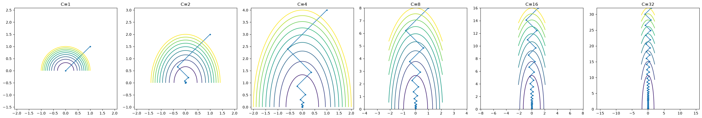
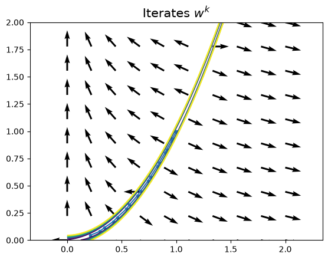
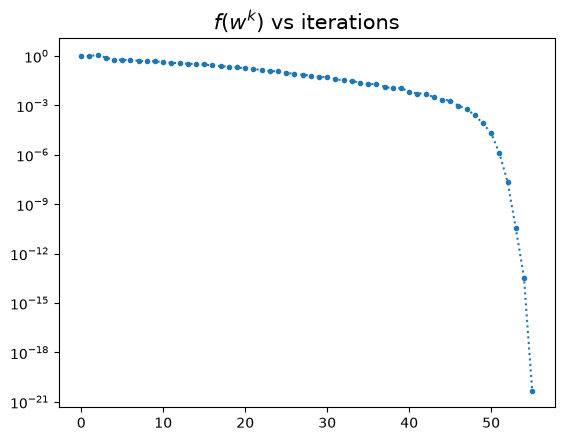
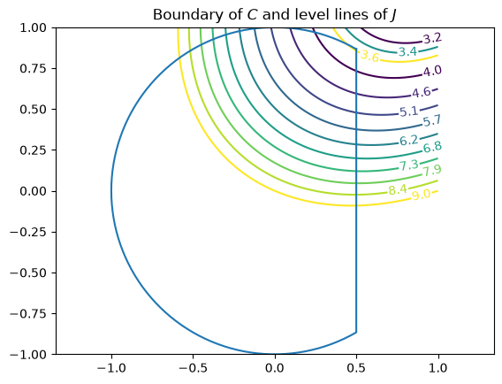
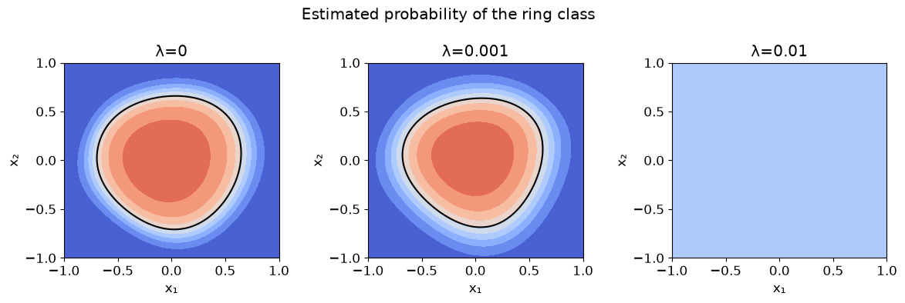

# Numerical optimization: gradient, Newton, constraints and sparsity

Four labs from the numerical optimization course at Centrale Lille, implemented from scratch in NumPy: gradient descent and line search, Newton and quasi-Newton (BFGS) methods, constrained optimization with interior points and Uzawa's algorithm, and ℓ1-regularized stochastic optimization with ISTA.



## Highlights

- **Conditioning made visible**: on a quadratic with condition number C, optimal-step gradient descent zigzags more and more, and the number of iterations grows linearly with C.
- **Armijo backtracking line search** on a non-convex function, then **Newton's method on the Rosenbrock function**: slow approach, then quadratic convergence as soon as the full step is accepted (21 iterations).
- **BFGS**: 55 iterations without ever solving a linear system, with the inverse-Hessian approximation reaching a 0.3% relative error.
- **Constrained problem** solved analytically through the KKT conditions, then numerically with a log-barrier interior-point method and with **Uzawa's algorithm**, which recovers the minimizer to machine precision.
- **ISTA and soft thresholding**: closed-form ℓ1 proximal operator, sparsity vs accuracy on a non-convex test function, and a stochastic version that prunes the weights of a small neural network.

## Contents

| Lab | Topic | Main concepts |
|---|---|---|
| [Lab 1](lab1/lab1.ipynb) | Gradient descent | optimal step, conditioning, Armijo line search, local convexity |
| [Lab 2](lab2/lab2.ipynb) | Newton and quasi-Newton methods | Newton-Raphson, quadratic convergence, BFGS update, secant equation |
| [Lab 3](lab3/lab3.ipynb) | Constrained optimization | KKT conditions, Slater, interior-point (log-barrier) method, Lagrangian duality, Uzawa |
| [Lab 4](lab4/lab4.ipynb) | Stochastic gradient and ℓ1 regularization | sparsity, soft thresholding, ISTA, mini-batch stochastic ISTA |

## Repository layout

```text
.
├── lab1/lab1.ipynb
├── lab2/lab2.ipynb
├── lab3/lab3.ipynb
├── lab4/lab4.ipynb
├── docs/                 # Figures used in this README
└── requirements.txt
```

## Run it

```bash
pip install -r requirements.txt
jupyter notebook lab1/lab1.ipynb
```

All outputs and figures are saved, so the notebooks can be read without running them.

The teaching library `toynn_2023` used in the last part of Lab 4 was not provided. That experiment is therefore self-contained: it trains a NumPy network with the same architecture (2–8–8–8–1) on a ring classification problem, with mini-batch gradients, a decreasing step and ℓ1 soft thresholding. Its scores should not be read as the exact outputs of the original library.

## Context

Coursework for the numerical optimization course, Centrale Lille. The lab statements and some starter code were provided by the teaching staff; the missing answers, fixes and analysis are my own. More on my [portfolio](https://ugo-roccamatisi.github.io).

## Gallery

| | |
|---|---|
|  |  |
|  |  |
